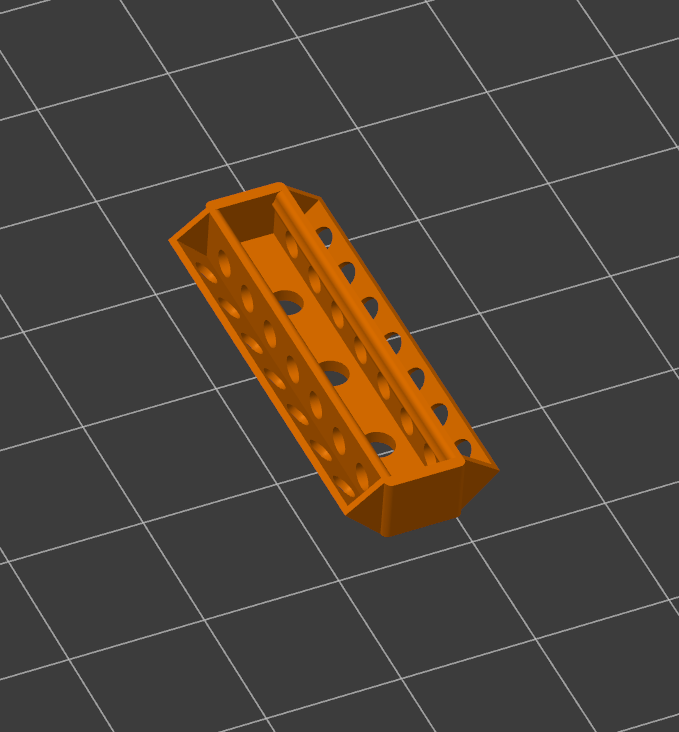

# P2 P2 3D models

These are the STL files needed to print the P2 P2 Cube gen1.
- 6 x face plate and 6 x PCB liner
- (OR) 6x combined face plate and PCB liner
- 48 x joint posts
- 32 x snap joint flanges
- 16 x snap joint caps
- 8 x magnet joint flanges

The face plate and PCB liners are offered in an alternate form above, where the STL model is fully connected -- You can print them both as one part. The only thing that connects them is a tiny sub-millimeter bridge which can be clipped off. 3D slicers often ignore it anyway, so you end up with two parts printed in one pass.

**NOTE**: The previews for the combined face and liner model do not show them as they should be assembled. This layout is only for printing optimazation. To see how the assembly fits together after printing, see the section on [assembly](assembly.md)

## Illustrations

#### [Face Plate](face_plate.stl)
 

#### [PCB Liner](pcb_liner.stl)

#### [Face Plate & PCB Liner](combined_face_plate_and_liner.stl) 

#### [Joint Post](joint_post.stl)

#### [Snap Joint Flange](snap_joint_flange.stl)

#### [Snap Joint Cap](snap_joint_cap.stl)

 

#### [Magnet Joint Flange](magnet_joint_flange.stl)

