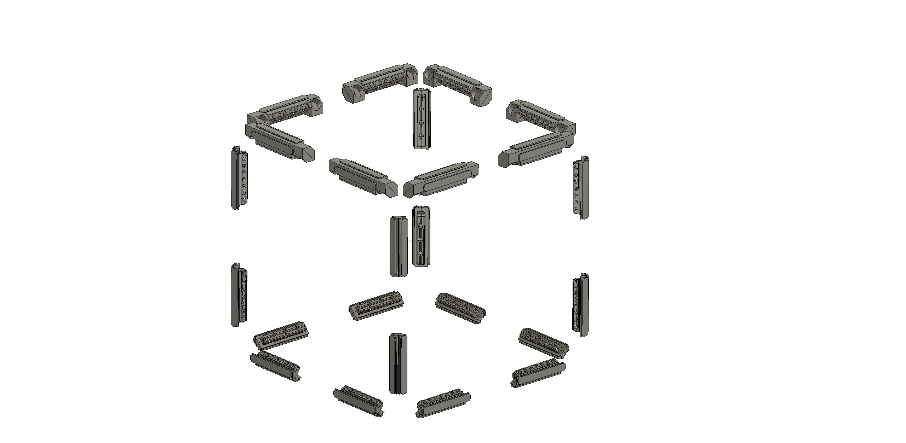
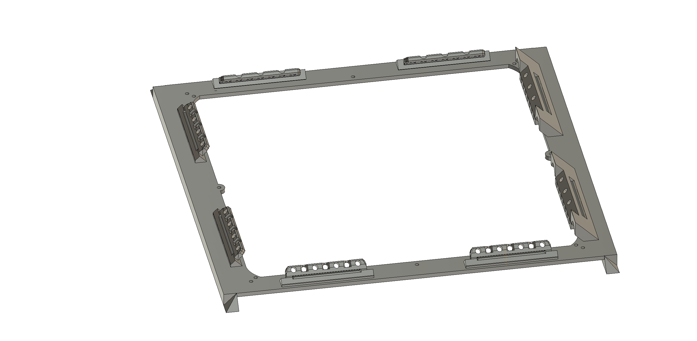

# Assembling the Cube Frame

**NOTICE**: Do not drop your LED panels during construction. You will be sad.

## Assembly Instructions

Each of these major steps has its own section below under the marked headings.

1. Familiarize yourself with the **part descriptions** below.
2. **Print your parts** and ensure printer accuracy
3. **Assemble the joints** onto the face plates.
4. Remove the stock plastic frames and **transfer the LED PCBs** to the face plates.
5. **Build the frame** using the snap joints.
6. **Wire it Up** (TBD)

## 01 Part Descriptions

This section describes the function of each printed part, and how they fit together.

### Face Plate

This is the outer shell of the cube. It is what the LED panels are screwed to. The face plate replaces the stock frame that comes with this particular model of LED panel. The screws holes are in the same place as the stock frame. 

Each faceplate has two edges. When combined, all six face plates will protect all 12 edges of the cube. There is only one way to assemble this correctly, so if it isn't clear how this works, you will see during assembly.

*Important* - You must use a different set of screws than those that came with the base. See the BOM for details. The stock screws would screw too far into the LED PCB and possibly short out the LED drivers. You want to use the 1mm x 3mm selt-taping screws from the kit listed in the bill of materials.
    
### PCB Liner

These are special separators which specifically shaped to match the back of the PCB layout. The purpose of these plates is to provide a safety barrier over the back of the LED driver circuit so that it is more difficult to cause a short or other damage while working in the cube, or when some loose items in the interior of the cube shift or fall. This allows you to be a bit more cavalier in how you place things within the cube during wiring.

The liner plates attach to the snap joints and magnet joints using the small holes on the sides of the joint covers. They have to be flexed slightly to go into place. Also, you need to align the liner plate to match the configuration of the capacitors. There is only one way they will align properly.

The liner plates are designed to work specifically with the model of LED panels which are sold by Parallax. If you want to use a different model, a different liner plate will need to be designed for it.

### Joint Posts

All the joints in this design are fastened to the face plates by inserting the joint posts through the front of the face plate and gluing the correct joint flange to the back. You will know that the joint posts are correctly installed when the base of the joint post disappears and makes a flat surface with the face plate. All of the joint posts are the same. Only the joint flange changes depending on whether you are installing a snap joint or a magnet joint.

### Snap Joint Flange and Caps

The snap joints are made from 3 components: the joint post, the snap joint flange, and the snap joint cap. When two snap joint flanges meet at an edge, they should lie against each other along the dividing plane that goes from the center of the cube through the edge. These flanges are shaped such that you can snap a snap joint cap over the top to hold them together. Once snapped together, it *IS* possible to remove them if you need, but not accidentally, and not without a small pry tool. 

### Magnet Joint Flange

The magnet joints are different from the snap joints and are meant to be used along the _top_ edge of the cube. The magnets are inserted into the magnet joint flange so that N and S poles will always meet.

## 02 Print the Frame Parts

We want the P2 P2 cube frame to be fun to build, flexible for experimentation, and relatively durable. As such, the 3d models were refined and tested to ensure that you can reliably print the frame without any supports!

Generaly speaking supports are hit or miss depending on the filament and/or printer features. Dialing in the right settings so that they are effective yet easy enough to take off is difficult even with really good printers. With flat parts, even more so. So, to keep things simple we avoiding requiring supports at all All of the parts were designed to have 45 degree overhangs at most. Most 3d printers can handle this with minimal effort.

A heated build plate is recommended. That is how these parts were tested. However, if you do not have a heated build plate, you can opt for rafts, but this may not yield the best results.

Most of the parts will work well enough with .2 mm layer heights. However, if you want to make assembly particularly easy, it is best to print the fasteners with .1 mm layer height. The first prototypes were printed using the adaptive layer height feature of Prusa Slicer, and results were generally very good with this. It also cut down on printing time.

It takes time to print. Try not to rush things with thick layer heights. It is recommended that you use .2 mm layer height for the plates, and .1 mm layer height for the joints to ensure that the tolerances are close enough for easy assembly. You may be printing things for a couple days, but if you are a seasoned 3d printer user, you know this goes with the territory. If you are eager, you can start printing the frame before your other parts arrive! 

You will have to glue a few things. It was considered an acceptable trade-off to require a minimal amount of gluing in stragegic places rather than have to fight with pulling supports off of flat faces and ruining the finish.

### Printing without Supports

Each of the printable parts is shown in the [README.md](README.md) as a preview. The provided images make it easy to see how to orient the parts on the build plate so that the correct face is down for printing. This ensures that the planar faces are finished nicely and that there are effectively no overhangs more than 45 degrees.

You can use the _place on face_ (F key) feature in Prusa Slicer to click the bottom face of the parts to orient them as shown.

### Using the combined model

The two biggest parts in the print are the face plate and the PCB liner. You can either print 6 of each separately, or you can use the combined model. You only need 6 face plates and 6 liners no matter how you decide to print them. 

### Testing for Accuracy

Before you print the whole model, you will want to ensure that your printer is printing parts accurately enough. If you want to do this in detail with the actual LED PCB panels, do the following:

1. print a single face plate (or combined face plate and liner)
2. Carefully remove a LED panel from its stock plastic frame
3. Align the two and shine a light through the screw holes.

If the LED PCB doesn't align to the plastic frame, then you will need to 
do some calibration and testing on your 3D printer before continuing. 

## 03 Assemble the Joints

### Panel Orientation

**Orientation**

The arrows on the LED panel indicate the flow of pixel data as well as *UP*. The basic flow of data for the whole cube is `bottom -> side1 -> side2 -> side3 -> side4 -> top`. Use the PCB label to determine which ways is *up*. (The label is on the bottom of the panel.) For the bottom panel, the label should be at the furthest edge from the base of the side1 panel. For the top panel, the label should on the closest edge to the side4 panel.

As long as you follow these rules, you'll have a correct panel alignment when you are done.
  
**Looking OUT from inside the CUBE**
    
    *-------*
    |       |
    |  TOP  |
    |   ^ ==|
    *---^---*-------*-------*-------*
    |   ^   |       |       |       |
    | SIDE4<<<SIDE3<<<SIDE2<<<SIDE1 |
    |     ==|     ==|     ==|   ^ ==|
    *-------*-------*-------*---^---*
                            |   ^   |
    Arrows indicate pixel   | BOTTOM|
    data flow. PCB labels   |     ==|
    are indicated with ==   |-------| 
                            

**Looking IN from outside the CUBE**
    
                            *-------*
                            |       | 
                            |  TOP  | 
                            |   ^ ==| 
    *-------*-------*-------*---^---*
    |       |       |       |   ^   | 
    | SIDE1>>>SIDE2>>>SIDE3>>>SIDE4 |
    |   ^ ==|     ==|     ==|     ==|
    *---^---*-------*-------*-------*
    |   ^   |
    | BOTTOM|  Arrows indicate pixel 
    |     ==|  data flow. PCB labels 
    *-------*  are indicated with ==

### Joint Positioning

For the bottom face plate, you will use snap joints on all 8 joint positions. 
The side faces will use snap joints on the bottom and side edges, and magnet joints on the top edge. The top panel will have magnet joints on all edges.

    bottom panel:        side panels:         top panel:    
    +------------+       +------------+       +------------+
    |   SS  SS   |       |   MM  MM   |       |   MM  MM   | 
    | S        S |       | S        S |       | M        M |
    | S        S |       | S        S |       | M        M |
    |            |       |            |       |            |
    | S        S |       | S        S |       | M        M |
    | S        S |       | S        S |       | M        M |
    |   SS  SS   |       |   SS  SS   |       |   MM  MM   |
    +------------+       +------------+       +------------+

This illustration shows all the joints without the rest of the frame:

This is what a side face will look like once you attach the 6 snap joint flanges and bases and the 2 magnet joint flanges and bases:

**Installing the Snap Joints**

**REMINDER**: Make sure you do this in a ventilated area.

The joints are the only part that requires gluing. To do this, simply insert the joint post through the front of the face plate and push on the appropriate flange on the back. It is *much* easier to simply glue the snap flange to the post than it is to worry about gluing all seams. The post fits tightly, and with the light blue it will make a strong connection by soaking into the tiny gaps between.

Ensure that you assemble the snap flanges in the orientation shown above! The flanges should line up so that the bigger flat section rests against the origin-to-edge plane -- That is, the flange shape should point to the middle of the cube. 

Also, before you glue it up, ensure that the joint post is aligned properly so that the base of it makes a flat surface with the front face of the face plate. If you need, use some flat pliers to squeeze it into position first. Very little effort should be required, so if it resists, slow down and double check the positioning of things. With decent quality prints, these joints will snap together in a satisfying way before being glued up without any clamps or other tools.

Once the joint is in place to your satisfaction, let some of the light CA glue flow into the cracks at the top of the post, where the round part of the post meets the inside box of the flange. Let is rest for a minute and then continue to the next joint.

**Installing the magnet joints**

The magnet joints should have the magnets installed before they are glued in:
1. Lay out all magnet joint flanges with the exact same orientation.
2. Press magnets into the left side using the same orientation for each one.
3. Flip your stack of magnets around and press them into the other side, so that if the left side was North, then the right side is South, and vice-versa.

Once you have the magnets in the magnet joint flanges, you install them to the panels in exactly the same way as the snap flanges. The only difference here is that you have to be ultra careful about the orientation. The flat surface of the magnet flange should be exactly where the origin-to-edge plane would be for the joint, That is, once the join is in place, it resembles a pyramid shape, as if each face were a pyramid shaped wedge taken from the cube. If you install the magnet joints backwards, you'll probably have to reprint and redo this part. It's best to test assemble some joints first if it isn't clear how they should go together.

## 04 Transfer the LED PCBs

Coming Soon!

## 05 Build the Frame

Coming Soon!